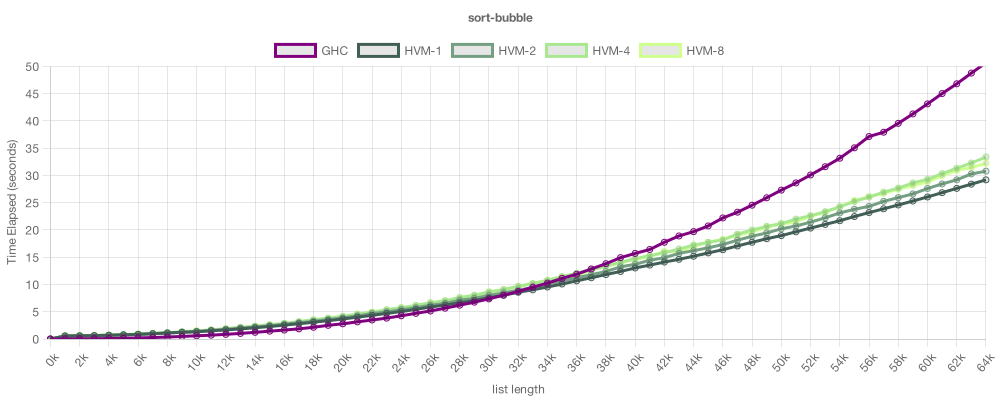
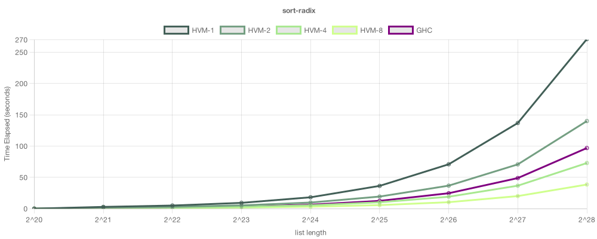

Functional Parallelism
======================

Introduction
------------

HVM, or High-order Virtual Machine, is a massively parallel runtime that lets
programmers write high-performance applications via the functional paradigm.
Before the HVM, developing multi-threaded software was hard and costly, since
the complexity of thread-safe synchronization demanded significant expertise and
time. Even though CPUs and GPUs have been shipping with increasingly more cores
over the years, programming languages have failed to catch up with that trend,
wasting a huge potential. HVM bridges that gap, decreasing the cost of parallel
software development drastically. This guide will teach you how  to make full
use of this capacity.

Bubble Sort
-----------

Let's get started with a simple algorithm: Bubble Sort. 

```javascript
// sort : List -> List
(Sort Nil)         = Nil
(Sort (Cons x xs)) = (Insert x (Sort xs))

// Insert : U60 -> List -> List
(Insert v Nil)         = (Cons v Nil)
(Insert v (Cons x xs)) = (GoDown (> v x) v x xs)

// GoDown : U60 -> U60 -> U60 -> List -> List
(GoDown 0 v x xs) = (Cons v (Cons x xs))
(GoDown 1 v x xs) = (Cons x (Insert v xs))
```

Complete file: [examples/sort/bubble/main.hvm](../examples/sort/bubble/main.hvm)



A Bubble Sort is **inherently sequential**, so HVM can't parallelize it.

TODO: explain the lines

TODO: comment on TIME, COST and RPS

Quick Sort
----------

A naive Quick Sort would be sequential.

```javascript
(Sort Nil) = Nil
(Sort (Cons x xs)) =
  let min = (Sort (Filter λn(< n x) xs))
  let max = (Sort (Filter λn(> n x) xs))
  (Concat min (Cons x max))
```

Solutions:

1. Avoid cloning with a single-pass partition

2. Avoid Concat by returning a tree instead

Improved algorithm:

```javascript
// Parallel QuickSort
(Sort Nil)         = Leaf
(Sort (Cons x xs)) =
  ((Part x xs) λmin λmax
    let lft = (Sort min)
    let rgt = (Sort max)
    (Node lft x rgt))

// Partitions a list in two halves, less-than-p and greater-than-p
(Part p Nil)         = λt (t Nil Nil)
(Part p (Cons x xs)) = (Push (> x p) x (Part p xs))

// Pushes a value to the first or second list of a pair
(Push 0 x pair) = (pair λmin λmax λp (p (Cons x min) max))
(Push 1 x pair) = (pair λmin λmax λp (p min (Cons x max)))
```

Complete file: [examples/sort/quick/main.hvm](../examples/sort/quick/main.hvm)

Benchmark:


TODO: comment on TIME, COST and RPS

Bitonic Sort
------------

The Bitonic Sort algorithm is possibly the most popular choice to implement
sorting in parallel architectures such as CUDA or OpenMP. While it has worse
asymptotics than Quick Sort, it minimizes parallel delay. It can also be drawn
as a pretty sorting network:


Implementing it in CUDA or similar requires careful orchestration of threads in
order to perform the swaps in synchronism.
[Here](https://people.cs.rutgers.edu/~venugopa/parallel_summer2012/cuda_bitonic.html)
is an example implementation. While this is doable, it is definitely not the
kind of code a functional programmer would like to write for a living. What is
less known, though, is that the Bitonic Sort has a very elegant presentation in
the functional paradigm:

```javascript
// Atomic Swapper
(Swap 0 a b) = (Both a b)
(Swap n a b) = (Both b a)

// Swaps distant values in parallel; corresponds to a Red Box
(Warp s (Leaf a)   (Leaf b))   = (Swap (^ (> a b) s) (Leaf a) (Leaf b))
(Warp s (Both a b) (Both c d)) = (Join (Warp s a c) (Warp s b d))

// Rebuilds the warped tree in the original order
(Join (Both a b) (Both c d)) = (Both (Both a c) (Both b d))

// Recursively warps each sub-tree; corresponds to a Blue/Green Box
(Flow s (Leaf a))   = (Leaf a)
(Flow s (Both a b)) = (Down s (Warp s a b))

// Propagates Flow downwards
(Down s (Leaf a))   = (Leaf a)
(Down s (Both a b)) = (Both (Flow s a) (Flow s b))

// Bitonic Sort
(Sort s (Leaf a))   = (Leaf a)
(Sort s (Both a b)) = (Flow s (Both (Sort 0 a) (Sort 1 b)))
```

Complete file: [examples/sort/bitonic/main.hvm](../examples/sort/bitonic/main.hvm)

Benchmark:


The RPS was greatly increased w.r.t the Quick Sort version, and its performance
scales quasi-linearly with the number of cores! In other words, we achieved
perfect parallelism, and we can expect this algorithm to scale horizontally.
Each time you double the number of cores, the run time would almost halve.

Sadly, the raw total cost increased a lot too, so, in this case, the run time is
slightly inferior than Quick Sort in a 8-core CPU. The Bitonic Sort could possibly
gain the edge if more cores were added, and there could be missing optimizatios
on my algorithm. Regardless, it is a great example on how we achieved massive
parallelism with minimal effort.

Radix Sort
----------

Finally, I'll present a last algorithm that can also parallelize perfectly. The
idea is pretty simple: we'll convert each number into an immutable tree, and
merge all the trees in parallel. The resulting tree will then contain all
numbers in ascending order. This is the algorithm:

```javascript
// Sort : Arr -> Arr
(Sort t) = (ToArr 0 (ToMap t))

// ToMap : Arr -> Map
(ToMap Null)       = Free
(ToMap (Leaf a))   = (Radix a)
(ToMap (Node a b)) = (Merge (ToMap a) (ToMap b))

// ToArr : Map -> Arr
(ToArr x Free) = Null
(ToArr x Used) = (Leaf x)
(ToArr x (Both a b)) =
  let a = (ToArr (+ (* x 2) 0) a)
  let b = (ToArr (+ (* x 2) 1) b)
  (Node a b)

// Merge : Map -> Map -> Map
(Merge Free       Free)       = Free
(Merge Free       Used)       = Used
(Merge Used       Free)       = Used
(Merge Used       Used)       = Used
(Merge Free       (Both c d)) = (Both c d)
(Merge (Both a b) Free)       = (Both a b)
(Merge (Both a b) (Both c d)) = (Both (Merge a c) (Merge b d))
```

Complete file: [examples/sort/radix/main.hvm](../examples/sort/radix/main.hvm)

Benchmark:



Now this is an algorithm! It has the parallelization of the Bitonic Sort, and
the complexity of the Quick Sort, without the worst cases. Of all algorithms I
tested so far, it seems to be the best performing on HVM.

...

TODO: review and continue this GUIDE. Good night! :)
